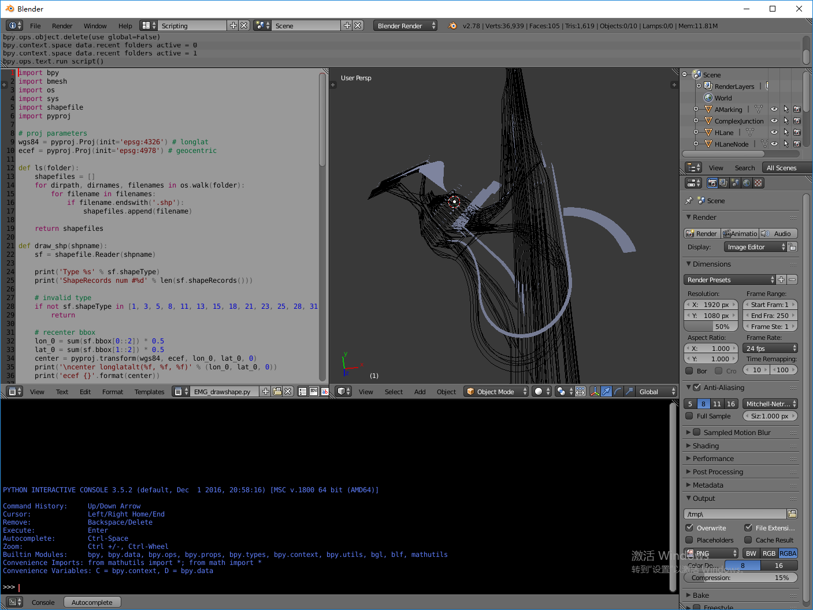

#Draw Shapefile

## 配置Blender和Python

### Install Pip without Internet

Download Pip wheel, setuptools wheel and wheel wheel from Unofficial Windows Binaries for Python Extension Packages[https://www.lfd.uci.edu/~gohlke/pythonlibs/].
```
/dir/to/blender/python/bin/python /dir/to/get-pip.py --no-index --find-links /dir/to/pip-wheel/and/setuptools/and/wheel
```

### 配置Blender Python

Blender使用自带的python，安装第三方库需要先在blender自带的python里安装pip，参考[How to use pip with bundled python](https://blender.stackexchange.com/questions/56011/how-to-use-pip-with-blenders-bundled-python/56013#56013)。

#### Windows

拷贝系统安装的python文件夹下的 Include/, DLLs/, /libs 到blender安装文件夹下的python文件夹 (比如C:\Program Files\Blender Foundation\Blender\2.78\python)。

#### MacOS

确保操作系统中已经安装和Blender自带python同版本的python(运行~/Downloads/blender-2.xx-macOS-xx.x/blender.app/Contents/Resources/2.xx/python/bin/python3.5m 获得python版本号)。

拷贝安装在操作系统下的python头文件到blender自带python的文件夹下。

```
$ cp /Library/Frameworks/Python.framework/Versions/3.5/include/python3.5m/* ~/Downloads/blender-2.xx-macOS-xx.x/blender.app/Contents/Resources/2.xx/python/include/python3.5m
```


### 安装Python Modules

1. [pyproj](https://github.com/jswhit/pyproj)
2. [pyshp](https://github.com/GeospatialPython/pyshp)

Windows:

```
> path\to\blender's\python.exe -m pip install <module_name>
```


MacOS:

```
$ ~/Downloads/blender-2.xx-macOS-xx.x/blender.app/Contents/Resources/2.xx/python/bin/python3.5m pip install <module_name>
```


一些Unix系统上Blender会使用系统已经安装的Python作为内置Console的运行环境。如果需要额外配置，请参考以上或其他网络资源。

## 运行

首先需要手动配置数据路径。打开EMG_drawshape.py，修改

```
pathname = 'D:\Documents\GIS\data\EMG_sample_data\EMG'
```

到指定数据文件夹。

如果指定的是文件夹，将一次性把文件夹下所有图层绘制成不同Mesh。

如果需要一次绘制单个文件，可以取消以下注释，并指定对应的文件名。

```
	# pathname = os.path.join(pathname, 'HRoad.shp')
```

打开Blender后，选则窗口顶部的Header->Choose Screen Layout->Scripting。


从本地文件夹中打开EMG_drawshape.py。


点击Run Script。


可以在3D View中看到按shapefile分层的不同Mesh。



## BUG Tracker

1. ~~原文件坐标变换后(WGS84 longlat to WGS84 ecef), 不同mesh之间坐标误差明显。误差在PolygonZ和PolylineZ文件之间尤其明显。~~
(画多个.shp文件时，统一使用第一个文件的bbox作为绘图的中心点)

2. ~~飞线问题：不同shape的part需要单独绘制，否则会有不应该存在的边被画出来。~~
(不能每次读到一个新坐标点直接根据下一个点生成一条新的边，需要先存储下每个part里的所有坐标点，之后再顺次连接它们。)

3. ~~无法显示单点类型的文件。~~
(POINTZ类型的.shp文件中每个shape没有parts，只有一个单点，不能通过遍历shape.parts来遍历所有坐标点。直接遍历shape.points即可。)
